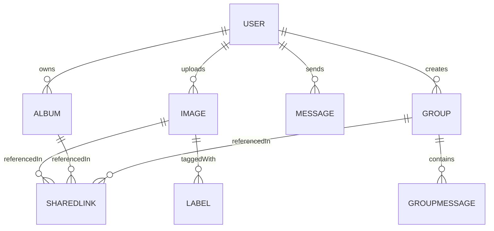
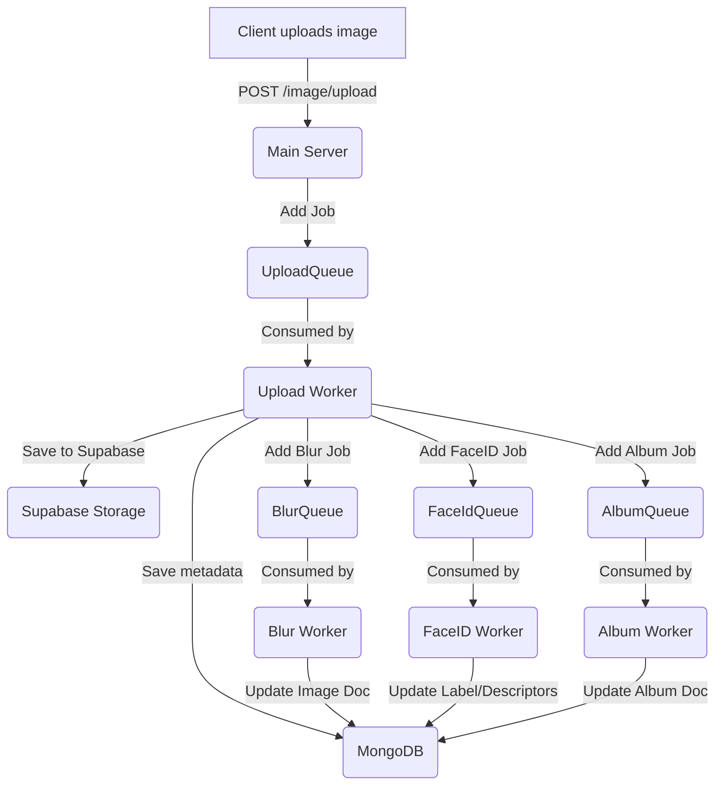

# 📚 Next Gallery Refactored Backend Documentation

Welcome to the comprehensive documentation for the **Next Gallery Refactored Backend**. This guide covers every key file in the repo, explaining its purpose, how it fits into the system, and its relationships with other modules.  

---

## 🗂️ Index

1. [Database Schemas](#1-database-schemas)  
2. [Background Workers & Queues](#2-background-workers--queues)  
   - [Queue Play/Pause Workaround](#queue-playpause-workaround)  
3. [Controllers & Routes](#3-controllers--routes)  
4. [Shared Libraries & Utilities](#4-shared-libraries--utilities)  
5. [Configuration & Entry Points](#5-configuration--entry-points)  

---

## 1. Database Schemas

All schemas live under `Schema/` (for main server) and `Workers/*/Schemas/` (for workers). They define MongoDB collections via Mongoose.

| File                              | Purpose                                                                                                                           |
|-----------------------------------|-----------------------------------------------------------------------------------------------------------------------------------|
| **Schema/albumSchema.js**         | Defines the **Album** model: images, metadata, blurring, ownership, with a pre-save hook to dedupe image references.             |
| **Schema/imageSchema.js**         | Defines the **Image** model: URL, geo-location, labels, who shared it, blurred placeholder, owner reference.                     |
| **Schema/labelSchema.js**         | Defines **Label** for face‐recognition descriptors tied to users (arrays of floats), plus blurred preview.                        |
| **Schema/messageSchema.js**       | Defines one‐to‐one **Message**: sender, receiver, content/media, read status, deletion flags.                                     |
| **Schema/groupSchema.js**         | Defines **Group** chat rooms: name, description, participants, admins, last message, deletion flags.                              |
| **Schema/groupMessageSchema.js**  | Defines **GroupMessage**: messages in a group, similar to `Message` but tied to a `Group` reference.                              |
| **Schema/relationSchema.js**      | Defines **Relation** (friendship): user-to-user status (pending/accepted/rejected), plus “autoSend” toggles per side.              |
| **Schema/sharedLink.js**          | Defines **SharedLink**: temporary links (expire in 6 hrs) to share images/albums/groups, with automatic TTL expiry.              |
| **Schema/sharedSchema.js**        | Mirror of `ImageSchema` for **shared** images, used when duplicating or retrieving shared data.                                   |
| **Schema/userSchema.js**          | Defines **User**: name, email (validated), password (hashed), profile picture, SEO privacy, with password‐hash middleware.      |

### 🖼️ Entity Relationship Diagram



---

## 2. Background Workers & Queues

The backend uses a robust **workers and queues system** for offloading resource-intensive tasks (like image processing, face recognition, uploads, and more) to background processes, ensuring the main server remains responsive and scalable.

### 🛠️ Workers Architecture

Each major pipeline (upload, album, blur, face ID) is handled by a dedicated worker, orchestrated via BullMQ and Redis. Each worker has a set of responsibilities and watches a specific queue.

| Worker Directory                | Consumed Queue(s)   | Main Responsibilities                                             |
|---------------------------------|---------------------|-------------------------------------------------------------------|
| `upload-worker`                 | UploadQueue, BlurQueue, FaceIdQueue | Handles uploads, creates blurred placeholders, triggers face-ID processing |
| `worker-album`                  | AlbumQueue          | Processes album creation and image association                    |
| `worker-blur`                   | BlurQueue           | Generates blurred image placeholders                              |
| `worker-face-id`                | FaceIdQueue         | Runs face recognition, labeling, and descriptor extraction        |

#### Key Worker Files

- **upload-worker.js / album-worker.js / blur-worker.js / face-Id-queue.js**  
  Entry points that spin up BullMQ workers, connecting to the relevant queue and processing jobs.
- **lib/blur-queue.js**  
  Centralizes creation and configuration of all BullMQ queues.
- **lib/connectDb.js**  
  Ensures workers connect to MongoDB for job execution.
- **lib/redis-clinet.js**  
  Sets up the Redis connection for BullMQ.

### 🔄 Data Flow: Worker Job Orchestration



### 🚨 Problem: BullMQ & Upstash Redis Compatibility

When using **Upstash Redis**, BullMQ queues can stall due to several limitations:

- **Limited support for EVALSHA and other advanced commands**
- **No support for stream-based polling**
- **Redis serverless timeouts**

#### ✅ Workaround: Manual Play/Pause Mechanism

To stabilize queue processing and avoid stalling jobs:

- **Queues are manually paused during critical DB/storage setup**
- **Queues are only resumed after all readiness checks have passed**
- **Prevents BullMQ from executing jobs prematurely, ensuring all dependencies (DB, storage, etc.) are fully available**

This manual intervention is implemented in each worker's startup logic, ensuring robust and predictable job processing even when using serverless or limited Redis providers like Upstash.

---

## 3. Controllers & Routes

Express controllers orchestrate HTTP endpoints; routes wire controllers into paths and middleware.

### 3.1 Album Endpoints

```api
{
  "title": "List Albums",
  "description": "Fetch all albums for the authenticated user, with optional filtering/sorting.",
  "method": "GET",
  "baseUrl": "https://api.example.com",
  "endpoint": "/album",
  "headers": [
    { "key": "Authorization", "value": "Bearer <token>", "required": true }
  ],
  "queryParams": [
    { "key": "year", "value": "Filter by year (e.g., 2023 or 'all')", "required": false },
    { "key": "sort", "value": "Sort criteria (e.g., '-Date')", "required": false }
  ],
  "bodyType": "none",
  "responses": {
    "200": {
      "description": "Success",
      "body": "{ \"albums\": [ /* Album objects */ ] }"
    },
    "401": {
      "description": "Unauthorized"
    }
  }
}
```

```api
{
  "title": "Create New Album",
  "description": "Upload cover image and create an album asynchronously via queue.",
  "method": "POST",
  "baseUrl": "https://api.example.com",
  "endpoint": "/album",
  "headers": [
    { "key": "Content-Type", "value": "multipart/form-data", "required": true },
    { "key": "Authorization", "value": "Bearer <token>", "required": true }
  ],
  "bodyType": "form",
  "formData": [
    { "key": "images", "value": "Image file(s)", "required": false },
    { "key": "Name", "value": "Album name", "required": true },
    { "key": "Description", "value": "Album description", "required": false }
  ],
  "responses": {
    "200": {
      "description": "Album queued for processing",
      "body": "{ \"message\": \"Album queued for processing\" }"
    },
    "400": {
      "description": "Validation error"
    }
  }
}
```

```api
{
  "title": "Get Album by ID",
  "description": "Retrieve a specific album (with metadata) by its ID.",
  "method": "GET",
  "endpoint": "/album/:id",
  "pathParams": [
    { "key": "id", "value": "Album ID", "required": true }
  ],
  "headers": [ { "key": "Authorization", "value": "Bearer <token>", "required": true } ],
  "responses": {
    "200": { "description": "Success", "body": "{ \"data\": { /* Album object */ } }" },
    "404": { "description": "Album not found or unauthorized" }
  }
}
```

```api
{
  "title": "Add Images to Album",
  "description": "Append new image references to an existing album.",
  "method": "PATCH",
  "endpoint": "/album/:id",
  "pathParams": [ { "key": "id", "value": "Album ID", "required": true } ],
  "headers": [ { "key": "Authorization", "value": "Bearer <token>", "required": true } ],
  "bodyType": "json",
  "requestBody": "{ \"photoArray\": [ { \"id\": \"<ImageId>\" }, ... ] }",
  "responses": {
    "200": {
      "description": "Images added",
      "body": "{ \"addedImages\": [...], \"duplicateImages\": [...], \"data\": { /* updated album */ } }"
    },
    "403": { "description": "Unauthorized or album not found" }
  }
}
```

*(Additional endpoints: DELETE `/album/:id`, GET `/album/images/:id`, POST `/album/share`, etc.)*

> **Route file**: `routes/albumRoutes.js` wires these to `controller/albumController.js`.

---

## 4. Shared Libraries & Utilities

Re‐usable modules under `lib/` and root:

- **lib/blur-queue.js**: Single source of truth for all BullMQ queues.  
- **lib/connectDb.js**: Central DB connector.  
- **lib/redis-clinet.js**: Redis connection wrapper.  
- **lib/util.mjs**: `getImageBlurred(src)` using [Plaiceholder] for LQIP base64 placeholders.  
- **upload.js** / **Workers/*/upload.js**: Supabase upload helper.  
- **supabase.js** / **Workers/*/supabase.js**: Instantiates Supabase client.  

---

## 5. Configuration & Entry Points

| File                    | Purpose                                                                                       |
|-------------------------|-----------------------------------------------------------------------------------------------|
| **ecosystem.config.js** | PM2/Ecosystem to run multiple apps: `server`, `blur-worker`, `face-id-queue`, etc.           |
| **package.json**        | Root dependencies (Express, Mongoose, BullMQ, etc.) and scripts.                              |
| **server.js**           | Starts Express HTTP server, applies middleware (CORS, JSON, cookies), mounts routers, protects routes, and connects DB. |
| **vercel.json**         | Vercel deployment config: single `server.js` entrypoint.                                      |
| **upload.js**           | Duplicate of worker‐upload helper at root for server use.                                     |

---

🎉 **Congratulations!** You’ve reached the end of the documentation. This guide should empower you to navigate the codebase, understand data flows, and extend functionality seamlessly.(Documentation Generated By AI, may have some undocumented concerns)
